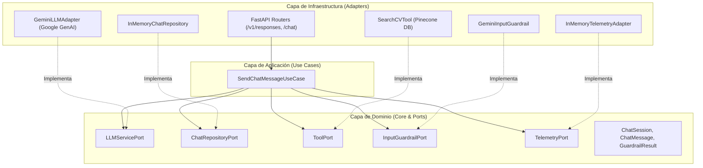

# 🤖 Banorte Challenge 2026 - CV AI Agent

[](https://www.python.org/)
[](https://fastapi.tiangolo.com/)
[](https://ai.google.dev/)
[](https://www.pinecone.io/)
[](https://cloud.google.com/run)
[](https://www.docker.com/)

Agente conversacional de IA autónomo diseñado para el **Reto Banorte 2026**. Implementa un sistema de **Retrieval-Augmented Generation (RAG)** estructurado bajo **Arquitectura Hexagonal (Ports & Adapters)**, con capacidades avanzadas de evaluación de guardrails y telemetría.

> [!NOTE]
> **Alcance del RAG & Base de Conocimientos**: 
> Este proyecto indexa y procesa únicamente la información profesional, formación académica, proyectos clave y trayectoria de su autor (**Alan Muñoz**). Por esta razón, la base de conocimientos RAG y el comportamiento del agente están especializados en responder consultas sobre este perfil en específico.

---

## 📌 Índice de Contenidos

- [1. 🚀 Inicio Rápido \& Infraestructura Cloud](#1--inicio-rápido--infraestructura-cloud)
  - [☁️ Despliegue en la Nube](#️-despliegue-en-la-nube)
  - [🔑 Requisitos Previos y Variables de Entorno](#-requisitos-previos-y-variables-de-entorno)
  - [💻 Instalación y Ejecución Local](#-instalación-y-ejecución-local)
  - [🌐 Endpoints de la API](#-endpoints-de-la-api)
- [2. 🧠 Filosofía de Diseño: Harness Engineering como Eje Central](#2--filosofía-de-diseño-harness-engineering-como-eje-central)
  - [🔨 Mi Proceso de Desarrollo Secuencial](#-mi-proceso-de-desarrollo-secuencial)
- [3. 🏗️ Arquitectura Hexagonal (Ports \& Adapters)](#3--arquitectura-hexagonal-ports--adapters)
  - [📐 Diagrama Hexagonal del Sistema](#-diagrama-hexagonal-del-sistema)
  - [🔄 Demostración de Intercambiabilidad y Extensibilidad](#-demostración-de-intercambiabilidad-y-extensibilidad)
    - [Ejemplo 1: Cambiar el Repositorio de Sesiones (Memoria ➔ PostgreSQL / MongoDB)](#ejemplo-1-cambiar-el-repositorio-de-sesiones-memoria--postgresql--mongodb)
    - [Ejemplo 2: Cambiar el Proveedor del Modelo (Google Gemini ➔ OpenAI)](#ejemplo-2-cambiar-el-proveedor-del-modelo-google-gemini--openai)
- [4. 🔍 Sistema RAG (Retrieval-Augmented Generation) \& Pipeline de Ingesta](#4--sistema-rag-retrieval-augmented-generation--pipeline-de-ingesta)
  - [📄 El Origen: Por qué mi CV tradicional no servía para RAG](#-el-origen-por-qué-mi-cv-tradicional-no-servía-para-rag)
  - [🔀 Estrategia de Búsqueda Híbrida (Semántica + Metadatos)](#-estrategia-de-búsqueda-híbrida-semántica--metadatos)
  - [🧩 Estrategia de Chunking basada en Evidencia](#-estrategia-de-chunking-basada-en-evidencia)
  - [🧪 Pipeline de Testing Automatizado y Métricas](#-pipeline-de-testing-automatizado-y-métricas)
  - [🚀 Plan de Mejora para el RAG](#-plan-de-mejora-para-el-rag)
- [5. 📊 Tracing y Telemetría para Operación](#5--tracing-y-telemetría-para-operación)
- [6. 🔮 Trabajo Futuro e Ideas de Mejora](#6--trabajo-futuro-e-ideas-de-mejora)

---

## 1. 🚀 Inicio Rápido & Infraestructura Cloud

### ☁️ Despliegue en la Nube
El agente se encuentra containerizado y desplegado en producción en la infraestructura serverless de **Google Cloud Run**, integrada con **Pinecone** como base de datos vectorial indexada:

* **Servidor backend**: Google Cloud Run (gestión de escalado automático a cero y puerto de escucha `8080`).
* **Base de datos vectorial**: Pinecone Index (`banorte-rag-index`), que almacena los embeddings densos con metadatos enriquecidos de la trayectoria del candidato.

---

### 🔑 Requisitos Previos y Variables de Entorno

Para ejecutar la aplicación localmente o desplegarla, es necesario configurar las siguientes variables en un archivo `.env` en la raíz del proyecto:

```env
# Claves para integración con LLM y RAG
GEMINI_API_KEY="tu_gemini_api_key"
PINECONE_KEY="tu_pinecone_api_key"
PINECONE_INDEX_NAME="banorte-rag-index"

# Token para endpoints protegidos (OpenResponses API)
API_KEY="tu_bearer_token"
```

* **Google Gemini API Key**: Necesaria para el modelo de lenguaje (`GeminiLLMAdapter`) y las evaluaciones de seguridad (`GeminiInputGuardrail`).
* **Pinecone API Key & Index Name**: Requeridos para realizar búsquedas semánticas e híbridas a través de la herramienta `search_cv`.

---

### 💻 Instalación y Ejecución Local

#### Opción A: Ejecución Directa con Python & Virtualenv

1. **Clonar el repositorio y crear entorno virtual**:
   ```bash
   git clone https://github.com/alanmunoz/Alan-AMT-reto-banorte.git
   cd Alan-AMT-reto-banorte
   python3 -m venv .venv
   source .venv/bin/activate
   ```

2. **Instalar dependencias**:
   ```bash
   pip install -r requirements.txt
   ```

3. **Ejecutar el servidor Uvicorn**:
   ```bash
   uvicorn main:app --host 0.0.0.0 --port 8080 --reload
   ```

#### Opción B: Ejecución con Docker

1. **Construir la imagen**:
   ```bash
   docker build -t banorte-cv-agent .
   ```

2. **Iniciar el contenedor**:
   ```bash
   docker run -p 8080:8080 --env-file .env banorte-cv-agent
   ```

---

### 🌐 Endpoints de la API

La aplicación expone una API REST moderna basada en **FastAPI**, accesible en `http://localhost:8080`:

| Método | Endpoint | Descripción | Autenticación |
| :--- | :--- | :--- | :--- |
| `POST` | `/v1/responses` | Endpoint compatible con el estándar **OpenResponses API**. Soporta respuestas tradicionales y streaming mediante SSE (`Server-Sent Events`). | Bearer Token (`API_KEY`) |
| `POST` | `/chat` | Endpoint alternativo de conversación simplificado DTO. | Opcional |
| `GET` | `/telemetry` | Obtiene métricas de uso, latencia, consumo de tokens y ejecuciones de guardrails. | No requerida |
| `GET` | `/health` | Chequeo de estado del servicio y versión de la aplicación. | No requerida |

---

## 2. 🧠 Filosofía de Diseño: Harness Engineering como Eje Central

En la construcción de este proyecto utilicé tres disciplinas fundamentales de la ingeniería de IA: **Prompt Engineering**, **Context Engineering** y **Harness Engineering**. Sin embargo, mi enfoque principal estuvo en el **Harness Engineering**, ya que fue la técnica que me permitió construir un agente robusto de manera secuencial y ordenada (paso a paso, agregando una pieza tras otra sin perder el control del sistema).

```
┌────────────────────────────────────────────────────────────────────────┐
│                        AGENT HARNESS CONTAINER                         │
│                                                                        │
│  ┌──────────────────┐   ┌─────────────────────┐   ┌─────────────────┐  │
│  │ Input Guardrails │──>│ Use Case Controller │──>│ Telemetry/Trace │  │
│  └──────────────────┘   └──────────┬──────────┘   └─────────────────┘  │
│                                    │                                   │
│            ┌───────────────────────┼───────────────────────┐           │
│            ▼                       ▼                       ▼           │
│  ┌──────────────────┐   ┌─────────────────────┐   ┌─────────────────┐  │
│  │ Context / RAG    │   │  System Prompts     │   │ Session State   │  │
│  │ (search_cv Tool) │   │ (Prompt Engineering)│   │ (Repository)    │  │
│  └──────────────────┘   └─────────────────────┘   └─────────────────┘  │
└────────────────────────────────────────────────────────────────────────┘
```

### 🔨 Mi Proceso de Desarrollo Secuencial
Para mí, el harness representó el "arnés" o infraestructura circundante que dota de determinismo, seguridad y observabilidad al modelo de lenguaje. Mi flujo de trabajo para armarlo fue el siguiente:

1. **Paso 1 - Context Engineering (La primera pieza del harness)**: La primera pieza que construí se basó en *Context Engineering*, donde parseé e indexé en un sistema RAG todo el conocimiento sobre mi trayectoria académica y profesional con metadatos específicos.
2. **Paso 2 - Herramientas del Harness (Tooling & Retrieval)**: Una vez listo el contexto, agregué herramientas al harness para que el agente pudiera consultar esa información de manera precisa. En esta etapa me aseguré de testear minuciosamente la calidad del retrieval, la relevancia de los chunks devueltos y la precisión de la búsqueda antes de avanzar.
3. **Paso 3 - Prompt Engineering Integrado**: Con la base de contexto y las herramientas funcionando, incorporé técnicas de *Prompt Engineering* refinando el *System Prompt* con instrucciones de personalidad, límites de conocimiento y formato de respuesta. No vi los prompts como magia aislada, sino como un componente más que encaja dentro del harness.
4. **Paso 4 - Módulos de Operación y Seguridad**: Finalmente, extendí el harness agregando las piezas operativas necesarias para producción:
   * **Input Guardrails**: Filtro de seguridad previo para evaluar intentos de jailbreak, inyecciones de prompt o preguntas fuera de alcance (*out of scope*).
   * **Telemetría y Tracing**: Registro detallado de tiempos de ejecución, consumo de tokens y llamadas a herramientas.
   * **Manejo de Sesiones & Autenticación**: Persistencia de estado conversacional y validación de seguridad Bearer Token.
   * **Interfaz Abierta**: Capa de compatibilidad con la especificación estándar **OpenResponses API**.

---

## 3. 🏗️ Arquitectura Hexagonal (Ports & Adapters)

Opté por la **Arquitectura Hexagonal (Ports & Adapters)** porque es una técnica con la que estoy bastante familiarizado y considero que encaja a la perfección con la filosofía de **Harness Engineering**. 

Esta arquitectura me permite trabajar con un enfoque de **"bloques o piezas"**, donde los componentes están tan desacoplados que intercambiarlos resulta sumamente sencillo y no rompe en absoluto la funcionalidad ni la lógica del dominio.

### 📐 Diagrama Hexagonal del Sistema



---

### 🔄 Demostración de Intercambiabilidad y Extensibilidad

Al aislar por completo el dominio de la aplicación, cambiar cualquier infraestructura es cuestión de crear un nuevo adaptador y cambiar una línea de código en la inyección de dependencias.

#### Ejemplo 1: Cambiar el Repositorio de Sesiones (Memoria ➔ PostgreSQL / MongoDB)

Para este proyecto implementé un repositorio simple en memoria (`InMemoryChatRepository`), pero fácilmente podría haber utilizado **PostgreSQL** o **MongoDB** sin tocar una sola línea de mi caso de uso (`SendChatMessageUseCase`), simplemente implementando el puerto `ChatRepositoryPort`:

```python
# infrastructure/adapters/postgres_chat_repository.py
from typing import Optional
from domain.ports.chat_repository_port import ChatRepositoryPort
from domain.entities.chat import ChatSession

class PostgreSQLChatRepository(ChatRepositoryPort):
    def __init__(self, db_connection_string: str):
        self.db_pool = create_async_db_pool(db_connection_string)

    async def get_session(self, session_id: str) -> Optional[ChatSession]:
        # Consulta SQL a PostgreSQL para recuperar la sesión
        async with self.db_pool.acquire() as conn:
            row = await conn.fetchrow("SELECT data FROM sessions WHERE id = $1", session_id)
            return ChatSession.deserialize(row["data"]) if row else None

    async def save_session(self, session: ChatSession) -> None:
        # Guarda la sesión serializada en PostgreSQL
        async with self.db_pool.acquire() as conn:
            await conn.execute(
                "INSERT INTO sessions (id, data) VALUES ($1, $2) ON CONFLICT (id) DO UPDATE SET data = $2",
                session.session_id, session.serialize()
            )
```

**Sustitución en mi inyección de dependencias (`main.py`):**
```python
# Solo cambio la instancia inyectada; mi UseCase ni se entera de que la base de datos cambió
app.state.chat_repository = PostgreSQLChatRepository(db_connection_string=os.getenv("DATABASE_URL"))
```

---

#### Ejemplo 2: Cambiar el Proveedor del Modelo (Google Gemini ➔ OpenAI)

De la misma manera, convertí el agente en una pieza aislada que se conecta al puerto `LLMServicePort`. Actualmente utilizo Google Gemini (`GeminiLLMAdapter`), pero fácilmente pude haber creado un adaptador para OpenAI (o Anthropic) sin alterar el comportamiento de la aplicación:

```python
# infrastructure/adapters/agent/openai_llm_adapter.py
from typing import List, Optional
from domain.ports.llm_service_port import LLMServicePort
from domain.ports.tool_port import ToolPort
from domain.entities.chat import ChatMessage
import openai

class OpenAILLMAdapter(LLMServicePort):
    def __init__(self, api_key: str, model_name: str = "gpt-4o"):
        self.client = openai.AsyncOpenAI(api_key=api_key)
        self.model_name = model_name

    async def generate_response(
        self,
        prompt: str,
        history: List[ChatMessage],
        tools: Optional[List[ToolPort]] = None,
        trace_id: Optional[str] = None,
        telemetry_service: Optional[any] = None,
    ) -> str:
        # Adaptación de las llamadas del puerto hacia la API de OpenAI
        messages = [{"role": msg.role, "content": msg.content} for msg in history]
        messages.append({"role": "user", "content": prompt})

        response = await self.client.chat.completions.create(
            model=self.model_name,
            messages=messages
        )
        return response.choices[0].message.content
```

**Sustitución transparente en la aplicación (`main.py`):**
```python
# Reemplazo el proveedor LLM en 1 sola línea de código:
app.state.llm_service = OpenAILLMAdapter(api_key=os.getenv("OPENAI_API_KEY"))
```

---


## 4. 🔍 Sistema RAG (Retrieval-Augmented Generation) & Pipeline de Ingesta

### 📄 El Origen: Por qué mi CV tradicional no servía para RAG
Cuando comencé el diseño del agente, me di cuenta rápidamente de que alimentar un sistema RAG simplemente lanzándole un PDF o un documento plano de mi currículum era un error. Los CVs tradicionales tienen formatos sintéticos que dificultan un *chunking* limpio y un *retrieval* preciso.

Decidí descomponer toda mi trayectoria profesional y personal en carpetas de conocimiento estructurado dentro de `rag_content/`, organizándola en **dominios bien definidos**:
* `experiencia_laboral`: Proyectos y roles en empresas (ej. Tecnoalfa, Codifying4u).
* `freelance`: Proyectos independientes y de consultoría.
* `educacion`: Título universitario (ESCOM IPN), intercambios internacionales (Polonia, Reino Unido) y certificaciones.
* `skills`: Resúmenes temáticos de competencias (Frontend, Backend, Cloud, DBs).
* `faqs`: Preguntas frecuentes sobre mi estilo de trabajo, movilidad y pretensiones.

Con estos dominios claramente delimitados, el agente puede identificar qué clase de contenido busca el usuario y hacer *retrieval* guiado.

---

### 🔀 Estrategia de Búsqueda Híbrida (Semántica + Metadatos)

Para recuperar la información implementé un enfoque de **Búsqueda Híbrida** ejecutando dos consultas en paralelo sobre Pinecone:

1. **Búsqueda A (Semántica por Embeddings)**: Captura la intención abstracta de la pregunta.
2. **Búsqueda B (Filtrada por Metadata / Tags)**: Busca coincidencias exactas en metadatos como `category`, `tech_stack` o `topic`.

```
                  ┌───────────────────────────────┐
                  │    Consulta del Usuario       │
                  └──────────────┬────────────────┘
                                 │
                 ┌───────────────┴───────────────┐
                 ▼                               ▼
       ┌──────────────────┐            ┌──────────────────┐
       │   Búsqueda A     │            │   Búsqueda B     │
       │ (Semántica Dense)│            │ (Filtro Metadata)│
       └────────┬─────────┘            └────────┬─────────┘
                │                               │
                └───────────────┬───────────────┘
                                ▼
                   ┌────────────────────────┐
                   │ Deduplicación & Fusion │
                   └────────────┬───────────┘
                                ▼
                   ┌────────────────────────┐
                   │ Chunks enviados a LLM  │
                   └────────────────────────┘
```

> **¿Por qué filtrado por metadatos y no Keyword/BM25?**
> En ingeniería de software abundan los nombres propios de tecnologías, librerías o proyectos (ej. *Strapi, PostgreSQL, Eplanner*). Una búsqueda semántica pura a menudo diluye estos nombres. Descarté implementar BM25/sparse por complejidad de tiempo e infraestructura, sustituyéndolo por un filtrado estricto por tags.

#### ⚠️ Regla de Oro: 100% Trazabilidad en Metadata
Durante la fase de etiquetado descubrí que **si la metadata no está presente textualmente en el chunk, el LLM alucina**. Por ejemplo, si en la metadata de un proyecto agregaba la etiqueta `express` pero el texto solo mencionaba `TypeScript y Node.js`, el modelo intentaba responder sobre mi experiencia con Express sin tener contexto real de qué hice con él. **Toda metadata en mi pipeline es 100% trazable al contenido del texto.**

---

### 🧩 Estrategia de Chunking basada en Evidencia

Mi primer impulso fue considerar fragmentar cada proyecto en múltiples sub-chunks (uno para backend, otro para frontend, otro para despliegue). Sin embargo, al analizar mi dataset (~9 proyectos clave en total), concluí lo siguiente:

* **1 Chunk por Proyecto Completo**: Fragmentar un proyecto pequeño en 3 sub-chunks hace perder la coherencia narrativa y no aumenta la precisión, ya que casi siempre que pregunten sobre un proyecto (ej. *Eplanner*), el modelo necesitará el contexto global de dicho proyecto.
* **Criterio guiado por Pruebas**: Mi regla fue **no fragmentar por anticipación, sino por evidencia de fallas**. Diseñé pruebas con preguntas ultra puntuales (ej: *¿has trabajado con OAuth2?*, *¿qué experiencia tienes optimizando Core Web Vitals?*). Si en las pruebas un chunk no se recuperaba bien para esas preguntas específicas, solo en ese momento se justificaba partirlo en 2 (compartiendo `parent_id` y tags).
* **Configuración del Vectorizador**: Utilicé `text-embedding-001` de Google Gemini con una dimensión vectorial reducida a **768**. Para un catálogo pequeño de chunks, reducir la dimensión a 768 ahorra espacio y costo con una diferencia imperceptible en precisión. Se eligió el modelo `001` debido a que el `002` es multimodal y este RAG procesa únicamente texto.

---

### 🧪 Pipeline de Testing Automatizado y Métricas

Para evaluar el comportamiento del RAG construí un script benchmark (`tests/test_agent_rag_responses.py`) apoyado por un wrapper (`LoggingSearchCVTool`). Este wrapper intercepta las llamadas entre el LLM y la herramienta de Pinecone, registrando la query exacta generada por el agente, los filtros aplicados y los IDs de los chunks devueltos.

Etiqueté manualmente un conjunto de prueba de preguntas y utilicé evaluaciones asistidas por IA (bajo mi supervisión directa) para medir el rendimiento:

#### 📊 Resultados Globales de Evaluación

| Métrica | Puntaje | Diagnóstico / Observaciones |
| :--- | :---: | :--- |
| **Faithfulness (Fidelidad)** | **100%** | **Cero Alucinaciones.** El agente se adhiere 100% al contexto provisto. |
| **Guardrail Adherence** | **100%** | Manejo perfecto de jailbreaks, prompts maliciosos y preguntas out-of-scope. |
| **Recall de Chunks Esperados** | **92%** | Los chunks indispensables para responder las preguntas fueron recuperados exitosamente. |
| **Context Precision (Precisión)** | **64%** | **Área de Oportunidad (Contexto Muerto).** El sistema trae algunos chunks poco relevantes junto con los correctos. |

#### 💡 Hallazgo Clave del Testing:
El agente **nunca alucina** ni inventa datos. Sin embargo, al ser pocos chunks en Pinecone y forzar la búsqueda híbrida, el retrieval trae a veces 2 o 3 chunks extra que no tienen relación directa con la pregunta (*contexto muerto*). El agente es lo suficientemente inteligente para ignorarlos en su respuesta final, pero consumen espacio en la ventana de contexto.

---

### 🚀 Plan de Mejora para el RAG

Debido al time-box del reto no implementé el ajuste fino del retrieval, pero la hoja de ruta clara para eliminar el *contexto muerto* es la siguiente (en orden de prioridad):

1. **Fase 1 (Inmediata - Simplitud técnica)**: Incrementar el umbral mínimo de similitud coseno (`similarity_threshold`) en la consulta a Pinecone y reducir el parámetro `top_k` de 7 a 3-4 chunks.
2. **Fase 2 (Ajuste de Distancia y Embeddings)**: Evaluar la métrica de distancia (Dot Product o Euclidean en lugar de Cosine) o migrar a vectores de mayor dimensión (1536 / 3072) para forzar mayor separación espacial entre temas no relacionados.
3. **Fase 3 (Sub-chunking Granular)**: Si las opciones anteriores no bastan, subdividir los chunks de proyectos en temas más pequeños vinculados por un `parent_id` común. *(Esta es la última opción por ser la más tardada de re-indexar y probar)*.

---

## 5. 📊 Tracing y Telemetría para Operación

A lo largo de mi experiencia en desarrollo de software he aprendido que los **logs y la telemetría son indispensables para producción**. De nada sirve tener un pipeline de despliegue impecable ni configurar alertas de fallas si no cuentas con una forma clara de diagnosticar qué ocurrió exactamente tras bambalinas. En un entorno de producción estás completamente a ciegas si no existe observabilidad.

Por esta razón, consideré que la telemetría debía ser un pilar central dentro del *agent harness* y no un añadido de última hora.

```
                  ┌─────────────────────────────────────┐
                  │          Trace Execution            │
                  └──────────────────┬──────────────────┘
                                     │
         ┌───────────────────────────┼───────────────────────────┐
         ▼                           ▼                           ▼
┌─────────────────┐         ┌──────────────────┐        ┌──────────────────┐
│  Input Guardrail│         │ LLM Execution    │        │  Tool Execution  │
│  - Verdict      │         │ - Latency (ms)   │        │ - Tool Name      │
│  - Duration ms  │         │ - Tokens In/Out  │        │ - Query / Output │
└─────────────────┘         └──────────────────┘        └──────────────────┘
```

### 💻 Estado Actual y Preparación Arquitectónica
* **Telemetría en Memoria**: Por limitaciones de tiempo del reto, implementé la recolección de trazas en memoria RAM (`InMemoryTelemetryAdapter`), las cuales pueden ser consultadas libremente a través del endpoint `GET /telemetry`.
* **Desacoplamiento listo para Producción**: Debido a que toda la telemetría interactúa mediante el puerto `TelemetryPort`, la arquitectura está lista para que en el futuro se reemplace esa clase por un colector de nivel empresarial (como **OpenTelemetry**, **LangFuse** o **Arize Phoenix**) sin tocar una sola línea de la lógica de negocio ni del controlador.
* **Métricas Clave Monitoreadas**: Me enfoqué prioritariamente en medir la **latencia por etapa (ms)** y el **consumo de tokens (input/output)**, ya que considero que son los dos indicadores operativos y de costo más críticos al operar agentes conversacionales con LLMs.

---

## 6. 🔮 Trabajo Futuro e Ideas de Mejora

Existieron varias características e ideas que me hubiera gustado incorporar pero que no fue posible implementar debido al *time-box* del reto. La arquitectura modular basada en **Harness Engineering** y **Puertos y Adaptadores** deja el camino listo para integrar las siguientes mejoras:

### 🛠️ 1. Nuevas Herramientas en el Harness (Tools & MCPs)
Al estar el harness ya construido, agregar herramientas es sumamente sencillo:
* **Tool "Enviar CV por Correo"**: Permitir al usuario solicitar el envío de una versión formal en PDF de mi currículum directamente a su correo electrónico.
* **Tool "Agendar Entrevista"**: Integración directa con la API de mi Google Calendar para que reclutadores o interesados puedan agendar una llamada de entrevista en mis horarios disponibles.
* **Integración con MCPs (Model Context Protocol)**: Implementar servidores MCP de GitHub para permitirle al agente inspeccionar directamente mis repositorios públicos, commits y código fuente en tiempo real.

### 🎯 2. Skills Especializadas (Job Fit Matching)
Una de mis ideas iniciales era desarrollar una **Skill de Compatibilidad de Vacantes**:
* El usuario podría enviar el texto de una oferta de empleo (requisitos, stack tecnológico, rol).
* El agente extraería automáticamente los requerimientos y los compararía contra mi base de datos RAG para generar un reporte de compatibilidad (ej. *Match del 88%: Cumple con TypeScript, Node.js y Cloud Run; requerimiento de AWS cubrir con experiencia equivalente en GCP*).

### ⚡ 3. Optimización del Harness (Prompt Builder & Pre-fetching)
* **Prompt Builder Dinámico**: Módulo encargado de ensamblar contextualmente el prompt del sistema dependiendo de la intención detectada.
* **Pre-fetching de Contexto RAG**: Recabar contexto relevante antes de llamar al LLM principal en preguntas frecuentes para reducir la latencia de "ida y vuelta" (*round-trips*) de la herramienta de búsqueda.

### 🛡️ 4. Guardrails Eficientes y de Salida (Output Guardrails)
* **Input Guardrail basado en Embeddings**: El guardrail actual utiliza una llamada a Gemini para clasificar la intención. Reemplazarlo por un clasificador ligero basado en vectores/embeddings permitiría reducir la latencia a unos pocos milisegundos y disminuir costos.
* **Output Guardrails**: Implementar una capa posterior que valide que la respuesta generada por el LLM respete estrictamente los formatos esperados y no filtre datos sensibles antes de enviarla al cliente.

### 🗄️ 5. Persistencia Real & Evolución del RAG
* **Repositorio de Datos**: Migrar de `InMemoryChatRepository` a un repositorio basado en **PostgreSQL** o **Redis** para persistir el historial entre reinicios.
* **Búsqueda Híbrida Avanzada (Reranking)**: Incorporar un modelo de *Reranking* (ej. Cohere Rerank o BGE-Reranker) posterior a la deduplicación de Pinecone.
* **Ampliación Continua de Conocimiento**: Enriquecer el RAG con más casos de estudio detallados de mis proyectos pasados y ampliar la suite de pruebas automatizadas.

---
